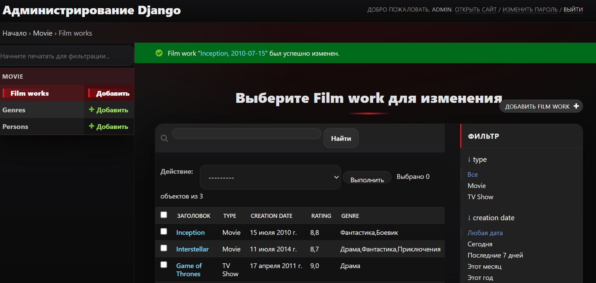
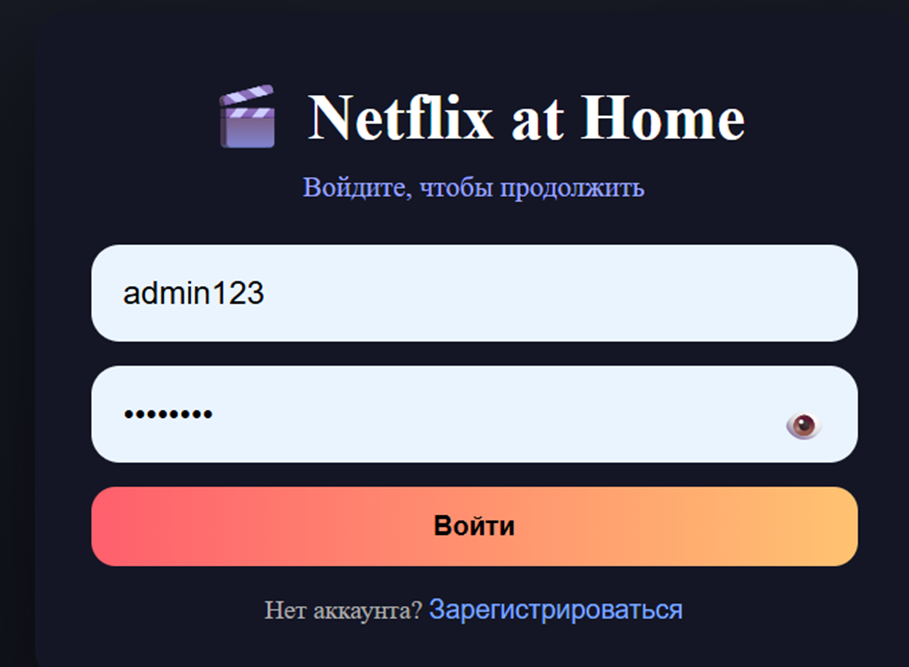
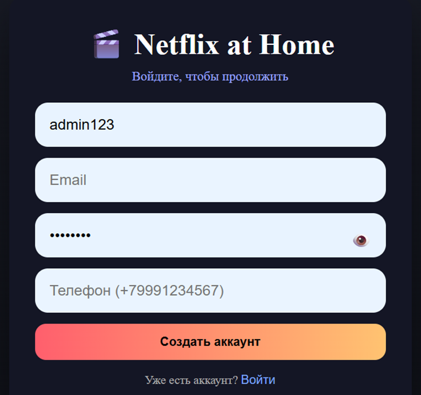
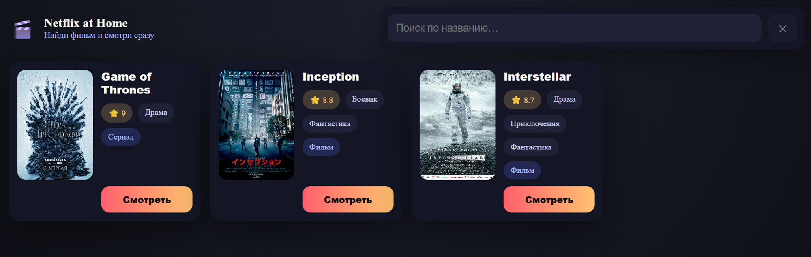
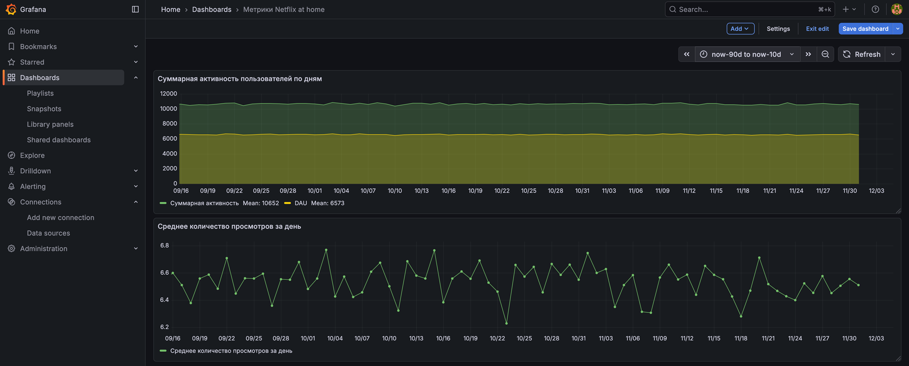

# NetflixAtHome

Проект онлайн-кинотеатра с микросервисной архитектурой, поиском по каталогу фильмов, системой авторизации, административной панелью, аналитикой пользовательской активности и ETL-пайплайном.

## О проекте

**NetflixAtHome** — учебный проект (Python: продвинутый уровень), целью которого является разработка полноценной системы для просмотра и поиска фильмов с поддержкой поискового движка, аналитики и масштабируемой архитектуры.

**Команда проекта:**

* Журавлев Кирилл — М8О-102СВ-25
* Кудрин Ярослав — М8О-102СВ-25
* Русаков Александр — М8О-103СВ-25
* Катин Иван — М8О-103СВ-25

## Цели и задачи

* Организовать систему просмотра и поиска фильмов с использованием поискового движка
* Реализовать административную панель для управления контентом
* Создать дашборд аналитики просмотров и пользовательской активности
* Построить ETL-пайплайн для переноса данных о фильмах в Elasticsearch
* Организовать сбор пользовательской активности и потоковое получение файлов из S3

## Функциональные требования

### Админка

* Авторизация с проверкой роли
* CRUD для фильмов, жанров и актёров
* Добавление превью фильма

### Авторизация

* Регистрация и логин пользователей
* JWT-аутентификация
* Роли и права доступа

### Контент-сервис

* Каталог фильмов
* Поиск и фильтрация
* Авторизация

### Метрики и аналитика

* Сбор пользовательской активности
* Отображение метрик в Grafana

## Нефункциональные требования

* **Доступность:** healthchecks, автоперезапуск контейнеров, rate-limit через Redis
* **Производительность:** низкая латентность за счёт Elasticsearch и Redis, асинхронный сбор метрик
* **Масштабируемость:** горизонтальное масштабирование stateless-сервисов и хранилищ
* **Безопасность:** JWT, изоляция сервисов, секреты через переменные окружения
* **Синхронизация:** асинхронная репликация данных из Postgres в Elasticsearch
* **Наблюдаемость и хранение:** логирование, отправка метрик в ClickHouse через Kafka без влияния на пользовательский поток, резервное копирование данных, дашборды в Grafana

## Админка



## Страница авторизации





## Главная страница


## Страница фильма



## Страница плеера


## Метрики



---

## 1. Auth

```bash
# Постгрес для админки
docker-compose up redis

# База для сервиса авторизации
docker-compose up database

# Cервис авторизации
docker-compose up nx_auth
```

Swagger будет доступен по адресу: [http://localhost:8001/api/openapi](http://localhost:8001/api/openapi)

## 2. Admin

```bash
# База для сервиса админки
docker-compose up database_nx_admin

# Админка для фильмов
docker-compose up nx_admin

# nginx, проксирует админку
docker-compose up nginx
```

Админка будет доступна по адресу: [http://localhost:8000/admin/](http://localhost:8000/admin/)

## 3. Content

```bash
# Elasticsearch для хранения
docker-compose up elasticsearch

# Контент-сервис
docker-compose up nx_backend
```

Swagger: [http://localhost:8002/api/openapi](http://localhost:8002/api/openapi)

## 4. ETL

```bash
# Контейнер с ETL
docker-compose up nx_etl
```

## 5. Настройка страницы метрик в Grafana

### 5.1. Запуск Grafana

```bash
docker-compose up -d grafana
```

### 5.2. Вход в Grafana

Используйте логин и пароль: `admin / admin`

### 5.3. Настройка источника данных ClickHouse

1. Добавить источник данных **Altinity plugin for ClickHouse**
2. В поле URL указать:

   ```
   http://clickhouse-node1:8123/
   ```
3. Сохранить источник данных

### 5.4. Импорт dashboard

1. Перейти в создание дашборда и выбрать **Import dashboard**
2. Выбрать файл `./grafana_dashboard/dashboard.json`
3. Нажать **Import**
4. Во всех панелях изменить источник данных на созданный ранее
5. Сохранить дашборд и нажать **Refresh**, если данные не отобразились
